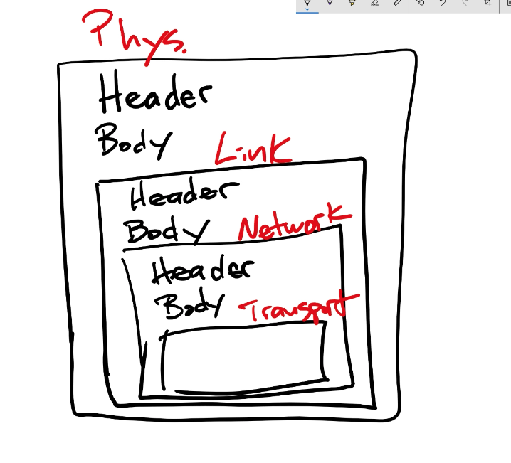
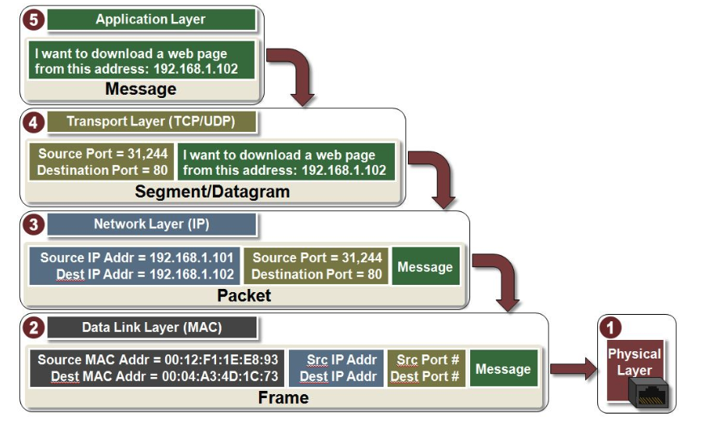

# Networking 201

The socket is the networking part we send data through..
An HTTP contains two contents the Headers and the Body. An example of one of the header is content-type

```
Content-Type: Applicaton/json
```


TCP has an header too

```
Source port
destination port
sequence number
acknowledgement number
```
The body of the TCP is the actual body of the HTTP. TCP keeps its own header.

The IP has its own header

```
source ip
destination ip
checksum
```

The body of the TCP is the body of the IP


The Link layer has the following headers

```
mac address
```

The body of the Link Layer is the entire body of the IP , same as physical






Read: https://microchipdeveloper.com/tcpip:tcp-ip-five-layer-model


